<div align="center">

<!-- Animated header SVG (rendered from this repo) -->


<!-- Typing intro -->
<a href="https://github.com/jmbt25">
  
</a>

<br/>

<!-- Profile views + followers -->


</div>

---

### 🧠 about

```ts
const joshua = {
  location:  "Taguig City, PH 🇵🇭",
  role:      "Solo dev / vibe-coder",
  building:  ["LaborQuest.app", "Three.js life sim", "AI side projects"],
  playing:   ["Dota 2", "Sintopia", "GTA V"],
  shippedWith: "Claude Code 🤖",
  philosophy: "ship today, perfect later"
};
```

---

### 🛠️ stack

<p>
  
  
  
  
  
  
  
  
  
  
</p>

---

### 🚀 currently shipping

> 🎮 **[Three.js Life Sim](https://jmbt25.github.io)** — plants, herbivores, predators, and humans forming tribes. Vanilla JS, no build tools.
> ⚖️ **[LaborQuest.app](https://laborquest.app)** — text-RPG that teaches Filipino workers their rights through real-world scenarios.
> 🤖 **AI-powered tools** — niche LLM wrappers, Discord bots, and weekend-shippable monetizable apps.

---

### 📊 the numbers

<div align="center">


<br/>


<br/>


</div>

---

### 🌌 contribution galaxy

<div align="center">


</div>

---

### 🤝 let's connect

<p align="center">
  <a href="mailto:joshua22.mbt@gmail.com"></a>
  <a href="https://github.com/jmbt25"></a>
  <a href="https://laborquest.app"></a>
</p>

<div align="center">
<sub>⚡ powered by caffeine, curiosity, and Claude Code</sub>
</div>
